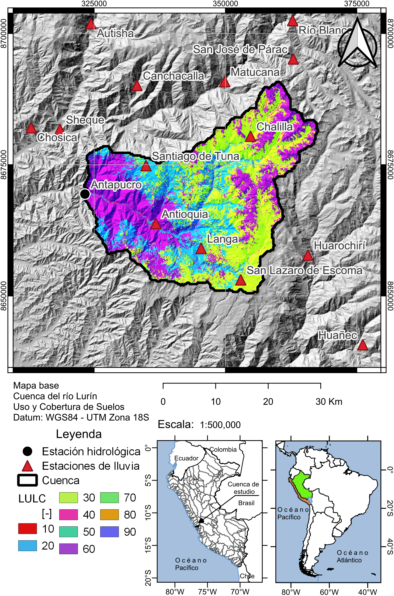
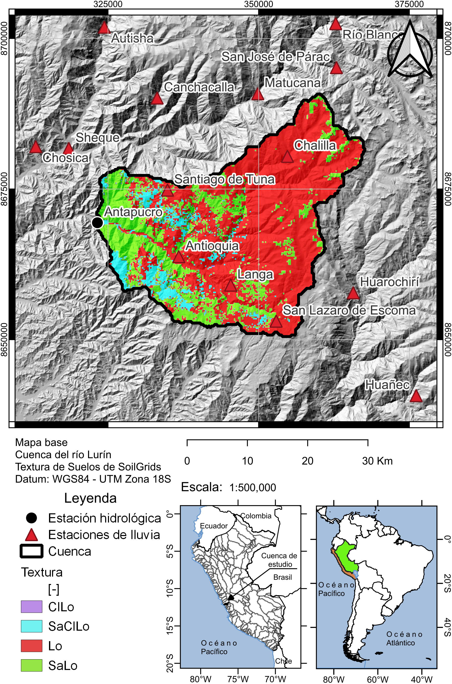
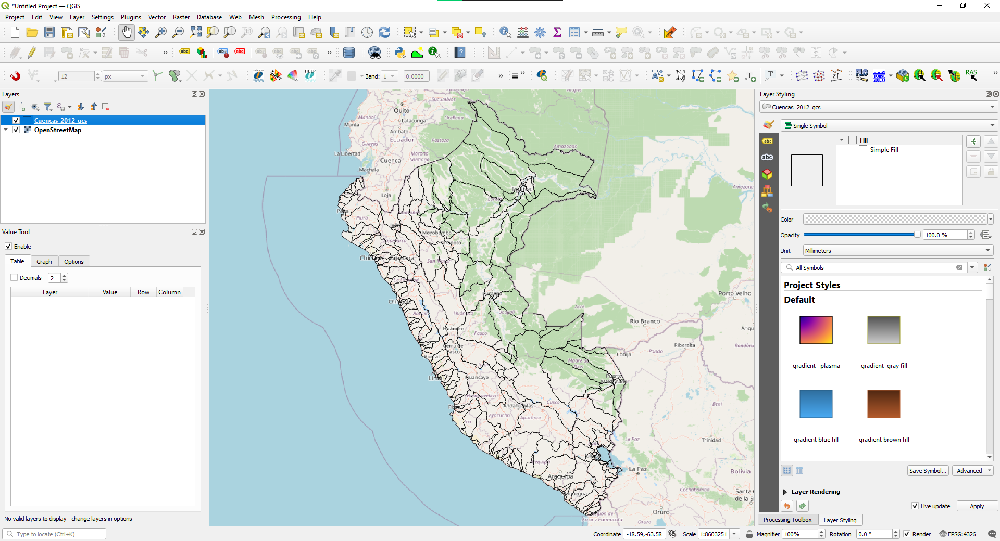
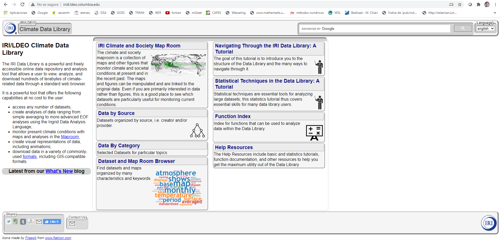
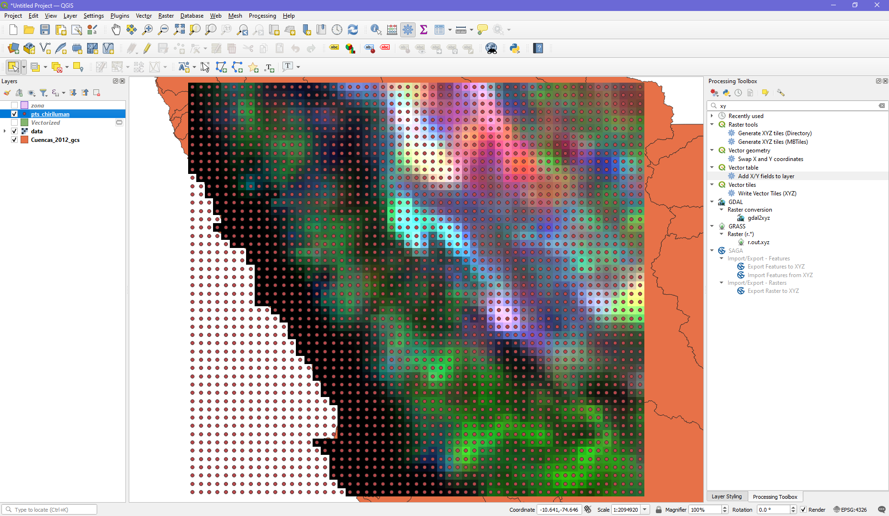

## Objetivos del Módulo I

Al finalizar el módulo cada alumno deberá de presentar mapas de las variables más importantes de su cuenca (precipitación, temperatura, LULC, clases de suelo, índices espectrales, etc), tal como se muestra a continuación:

<figure>
  
</figure>

 

<figure>
  
</figure>

 

<figure>
  
</figure>

## Explorando QGIS y leyendo información vectorial

Vamos a esplorar QGIS y cargadar el shapefile de cuencas hidrográficas que ya hemos descargado.

<figure>
  
</figure>

 

## Explorando Iri Data Library

En esta sección accederemos a la base de datos del producto grillado [PISCO](https://www.tandfonline.com/doi/abs/10.1080/02626667.2019.1649411). Para ello, vamos a ingresar a la siguiente website:

  * Acceder a través de la web [Iri Data Library](https://iridl.ldeo.columbia.edu/)
  

* Esta parte del procedimiento se realizará en misma web donde se aloja el producto PISCO
* Se debe descargar el producto PISCO precipitación y temperatura máxima y mínima y guardar en la carpeta de trabajo (data)

## Leyendo la base de datos descargada

<figure>
  
</figure>

 

> ## Sugerencia
>
> La ruta donde se localiza nuestra carpeta de trabajo no debe contener espacios
> ni caracteres a fin de evitar problemas en lo sucesivo. Dentro de ésta
> se debe de tener subcarpetas con los siguientes nombres:
> 
> * `/code`: donde guardemos los **scripts** que vayamos generando
> * `/data`: donde almacenemos la base de datos que vamos a descargar 
> * `/result`: donde guardemos los archivos y gráficos generados
> * `/shp`: donde guardemos los vectoriales
> * `/raster`: donde guardemos los archivos raster
> * `/qgis`: donde guardemos el proyecto QGIS
>
{: .callout}
