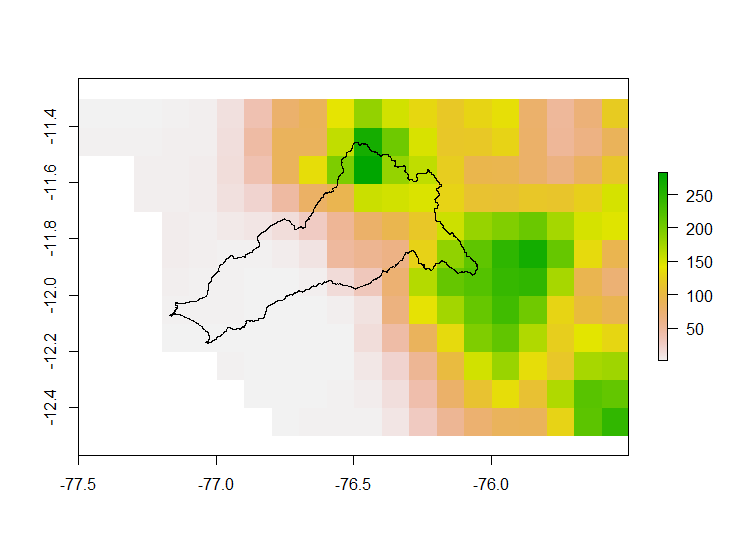

## Objetivos del Módulo I

Al finalizar el módulo cada alumno deberá de presentar mapas de las variables más importantes de su cuenca (precipitación, temperatura, LULC, clases de suelo, índices espectrales, etc), tal como se muestra a continuación:

<figure>
  
</figure>

<br>

<figure>
  
</figure>

<br>

<figure>
  
</figure>

## Explorando QGIS y leyendo información vectorial

Vamos a esplorar QGIS y cargadar el shapefile de cuencas hidrográficas que ya hemos descargado.

<br>

<figure>
  
</figure

<br>

## Explorando Iri Data Library

En esta sección accederemos a la base de datos del producto grillado [PISCO](https://www.tandfonline.com/doi/abs/10.1080/02626667.2019.1649411). Para ello, vamos a ingresar a la siguiente website:

  * Acceder a través de la web [Iri Data Library](https://iridl.ldeo.columbia.edu/)
  


* Esta parte del procedimiento se realizará en misma web donde se aloja el producto PISCO
* Se debe descargar el producto PISCO precipitación y temperatura máxima y mínima y guardar en la carpeta de trabajo (data)

## Leyendo la base de datos descargada

Comencemos con definir la ruta de nuestra carpeta de trabajo:

```r
dir <- 'C:/directorio/de/trabajo/'
setwd(dir)
```

> ## Sugerencia
>
> La ruta donde se localiza nuestra carpeta de trabajo no debe contener espacios
> ni caracteres a fin de evitar problemas en lo sucesivo. Dentro de ésta
> se debe de tener subcarpetas con los siguientes nombres:
> 
> * `/code`: donde guardemos los **scripts** que vayamos generando
> * `/data`: donde almacenemos la base de datos que vamos a descargar 
> * `/result`: donde guardemos los archivos y gráficos generados
>
{: .callout}

## Instalando los paquetes necesarios para leer la base de datos

Si no se tiene instalada la libreria `raster`, proceder como sigue a continuación:


```r
if (!require(raster)) install.packages("raster")
library(raster)
```
## Leer el producto PISCO descargado (base de datos de precipitación mensual)

Si no se tiene instalada la libreria `raster`, proceder como sigue a continuación:

* Leer el archivo `netCDF`

```r
pr <- brick('../data/pr.nc')
crs(pr) <- '+proj=longlat +datum=WGS84 +no_defs'
plot(pr[[1]])
```

* Leer el shapefile de la cuenca de estudio

```r
mask <- shapefile('../shp/rimac.shp')
plot(mask,add=T)
```

Deberíamos obtener algo como esto

<figure>
  
</figure>